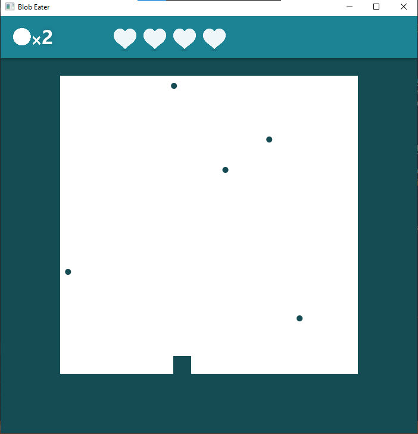

# Beskrivelse av prosjektet
## Hva er det?
Prosjektet er et spill inspirert av [Space Invaders](https://en.wikipedia.org/wiki/Space_Invaders) og lignende Arcade-spill. Spilleren er en figur nederst på skjermen som kan bevege seg til høyre og venstre. Målet med spillet er å sanke så mange poeng som mulig. Man får poeng av å ta imot blobbene som regner ned. Hvis man ikke tar imot en blob, mister man ett liv.

### Bilde av applikasjonen:

## Logikk og struktur
Spill-logikken finner vi i pakken [`hovedprosjekt.Model`](./src/main/java/hovedprosjekt/Model), hvor klassen [`Computer`](./src/main/java/hovedprosjekt/Model/Computer.java) er den viktigste. Denne klassen er ansvarlig for å holde orden på spilleren og de andre entitetene i spillet, og for å sjekke etter kollisjoner og kalkulere liv og score. Spilltilstanden består av et spiller-objekt, en liste over entiteter, antall liv og nåværende score.

Spillet er tikk-basert. Slik det er satt opp akkurat nå, kjøres en `while`-løkke så lenge spillet er aktivt. Der kjøres alt av kalkulasjoner og applikasjonen sover i 10 millisekunder før neste kjøring. Dette fungerer greit når belastningen av kalkulasjonene er såpass konsistente som her. Hvis det er mye variasjon i kalkulasjonstiden kan spillet virke hakkete, og delta tid ville vært en bedre løsning.

# Diagram
Dette klassediagrammet viser klassestrukturen i logikk-klassene (`Model`).

# Spørsmål
1.	Arv benyttes for å implementerere den abstrakte klassen `Entity`. Klassen `NormalBlob` og klassen `Player` er de klassene som gjør dette. `Entity` kunne også vært et grensenitt, men da måtte noen identiske kodesnutter blitt skrevet i alle klasser som implementerte det, nemlig `getPosition`, `setPosition` og feltene `xPos` og `yPos`. En abstrakt klasse er derfor en bedre løsning, ettersom disse kan skrives samlet på ett sted. En bakside med tanke på innkapsling, er at `xPos` og `yPos` må være `protected` for at subklasser skal ha tilgang til dem, men dette gjør dem også tilgjengelig til andre klasser i pakken. Med tanke på innkapsling, burde `xPos` og `yPos` trolig blitt definert på nytt i alle subklasser, ettersom de da kan være `private`.

    Interface brukes i klassen EntityListIterator. Denne klassen implenterer `Iterator`-grensesnittet og har derfor metodene `next` og `hasNext`. Ettersom jeg fjerner elementer fra lista når jeg bruker denne iteratoren, starter den å iterere fra bakerste element i lista. Elementene fra iteratoren blir derfor ikke forskjøvet når jeg fjerner elementer fra lista.

    Delegering benyttes i `Computer`. I metodene `getHighScore` og `setHighScore`, delegeres det til et `HighScore`-objekt. Denne klassen håndterer lesing og skriving til fil for å lagre highscore. Den har metodene `getHighScore` og `setHighScore`. Denne funksjonaliteten kunne uten problem vært i `Computer`, men det var et krav i oppgaven at filhåndteringen skulle foregå i en egen klasse.

2.	Observatør-observert-teknikken er noe jeg ikke har brukt i prosjektet. Det hadde vært mulig å bruke det mellom spilleren og blobbene. `Player`-objektet kunne observert alle blobbene, og blobbene kunne gitt beskjed når de var nærme nok spilleren til å kollidere (+1 score) eller når de treffer bunnen av spillet (-1 liv). Det hadde også vært mulig å bruke det i `tick`-metoden i `Computer`. Her sjekker jeg om `Player`-objektet er satt til å bevege seg til høyre eller venstre, og jeg kjører `player.getMovement()`, selv om `movement` kanskje er det samme som forrige gang metoden ble kjørt. Hvis jeg bruker Observatør-observert-teknikken, slipper jeg å sjekke hva bevegelsen er satt til, ettersom den blir oppdatert når en endring skjer. Et annet eksempel på anvendelse av Observatør-observert-teknikken nevnes i punktet om MVC.

3. Dette har jeg gjort ved å legge det meste av logikken i `Model`, mens `Controller` fungerer som et bindeledd mellom `Model` og `View`. Jeg har en del felter i `Controller`, men mange av disse er bare referanser til felter i et `Computer`-objekt (som fungerer som `Model`), for å slippe å definere variablene på nytt (`Something something = computer.getSomething()`) for hver eneste metode. Selv om de fleste feltene i `Controller` ikke utgjør en unik del av tilstanden, er det noen felter som gjør det. Disse inkluderer `gameActive` og `gameThread`, som henholdsvis holder styr på om spillet er aktivt og tråden spillet kjører i. Logikken for å kjøre selve game-loopen befinner seg altså i `Controller`. Med tanke på MVC, kunne dette vært plassert i `Model`, og jeg kunne ha brukt Observatør-observert-teknikken for å oppdatere `View` når en endring skjer i `Model`. Når det kommer til `View`-delen, er denne for øyeblikket kun koblet opp mot `Controlleren`, slik den skal være.

4. Som nevnt helt i starten, går spillet ut på at en spiller beveger seg til sidene og forsøker å fange blobber. Spilleren har et antall liv og en score. Det er derfor dette som er kjernefunksjonaliteten til appen. Ikke alt er like viktig å teste, men kjernefunksjonalitet er svært viktig og derfor har jeg prioritert å teste nettopp dette i enhetstestene. Først og fremst testes konstruktørene til `Computer`, `Player` og `Value`. Videre testes oppførsel til disse. For eksempel testes det at man starter med 5 liv og 0 score, at spilleren beveger seg riktig, at spillerens posisjon er riktig, at liv og score ikke kan være negativ, at det trekkes fra/legges til riktige verdier til liv og score, eller at lesing og skriving av highscore til fil fungerer riktig. Andre deler av koden testes ikke, og dette er fordi det er av lavere prioritet/det er ikke en del av kjernefunksjonaliteten. `EntityListIterator` er et eksempel på dette. Denne klassen er kun ment som en hjelpeklasse for å utføre kalkulasjoner i den mer sentrale `Computer`-klassen.

**All kode har også java-docs som beskriver hvordan klassene og metodene fungerer, i tillegg til kommentarer i koden der det er relevant.**
